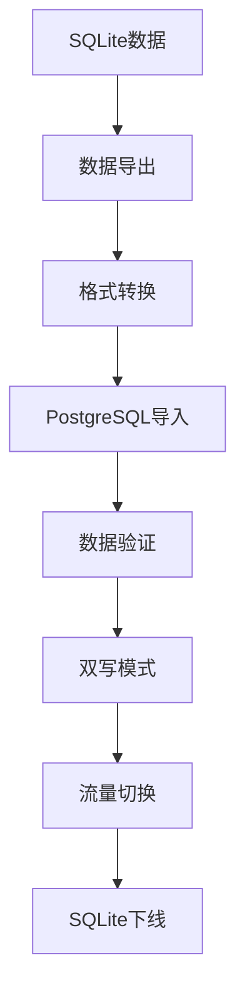
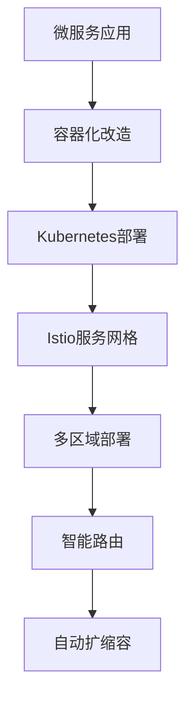

# AI英语工作助手 - 技术演进方案总览

## 概述

本目录包含了AI英语工作助手从MVP到企业级产品的完整技术演进方案。通过三个阶段的渐进式升级，确保产品能够从零成本启动逐步发展为支持百万用户的企业级应用，同时保证用户数据的完整性和业务的连续性。

## 技术演进路线图

```
┌─────────────────┐    ┌─────────────────┐    ┌─────────────────┐
│   MVP阶段       │───▶│   中期扩展       │───▶│   最终版本       │
│  (0-1K用户)     │    │  (1K-50K用户)   │    │  (50K+用户)     │
│                 │    │                 │    │                 │
│ • 零成本启动     │    │ • 性能优化       │    │ • 企业级架构     │
│ • 快速验证       │    │ • 可靠性提升     │    │ • 云原生部署     │
│ • 单体架构       │    │ • 微服务拆分     │    │ • 全球化服务     │
│ • 本地部署       │    │ • 集群化部署     │    │ • 智能运维       │
└─────────────────┘    └─────────────────┘    └─────────────────┘
```

## 文档结构

### 📋 [01-MVP技术选型方案.md](./01-MVP技术选型方案.md)
**适用场景**: 产品验证期，0-1K用户

**核心特点**:
- 🆓 **零成本启动**: 全部使用免费服务和开源技术
- ⚡ **快速开发**: 单体架构，开发效率优先
- 🔄 **平滑扩展**: 预留接口，支持后续升级
- 💾 **本地存储**: SQLite + Redis + Qdrant本地部署

**技术栈**:
- 前端: React + TypeScript + Vite
- 后端: Python + FastAPI + Uvicorn
- 数据库: SQLite + Redis + Qdrant + MinIO
- Agent框架: CrewAI (MVP阶段)
- 部署: Docker Compose + Vercel/Railway
- AI: 免费API组合（智谱AI、讯飞星火等）

**月成本**: $0 (完全免费)

---

### 📈 [02-中期扩展技术方案.md](./02-中期扩展技术方案.md)
**适用场景**: 业务增长期，1K-50K用户

**核心特点**:
- 🏗️ **架构升级**: 从单体到微服务的渐进式演进
- 🔄 **无缝迁移**: 数据零丢失，用户无感知升级
- 📊 **性能优化**: 集群化部署，读写分离，缓存优化
- 🛡️ **可靠性**: 高可用架构，监控告警，自动恢复

**技术栈**:
- 架构: 微服务 + API网关 + 服务网格
- 数据库: PostgreSQL集群 + Redis集群 + Qdrant集群
- Agent框架: CrewAI + LangGraph (渐进式引入)
- 存储: 云存储 + CDN
- 监控: Prometheus + Grafana + ELK
- 部署: Kubernetes + Docker

**月成本**: $115-2650 (按用户规模弹性)

---

### 🚀 [03-最终版技术架构方案.md](./03-最终版技术架构方案.md)
**适用场景**: 企业级产品，50K+用户

**核心特点**:
- ☁️ **云原生**: Kubernetes + Istio + 微服务全面云化
- 🌍 **全球化**: 多区域部署，就近访问，灾难恢复
- 🤖 **智能化**: AI驱动的资源调度和成本优化
- 🔒 **企业级**: 零信任安全，合规认证，审计追踪

**技术栈**:
- 架构: 云原生微服务 + 服务网格 + 边缘计算
- 数据库: 分布式PostgreSQL + Redis + Milvus + ClickHouse
- Agent框架: LangGraph主导 + CrewAI协作
- 基础设施: Kubernetes + Istio + Prometheus + Jaeger
- 安全: 零信任架构 + Vault + 端到端加密
- AI: 多模型智能路由 + 成本优化

**月成本**: $10K-50K (企业级规模)

## 升级策略详解

### 🔄 MVP → 中期扩展升级

#### 数据迁移策略


**关键步骤**:
1. **第1-2周**: 基础设施准备（PostgreSQL、Redis、Qdrant集群）
2. **第3-4周**: 数据迁移（双写模式 → 数据同步 → 验证）
3. **第5-6周**: 服务拆分（微服务开发 → API网关配置）
4. **第7-8周**: 切换上线（灰度发布 → 流量切换 → 监控）

**风险控制**:
- ✅ 数据一致性验证
- ✅ 实时备份机制
- ✅ 快速回滚方案
- ✅ 性能基线对比

### 🚀 中期扩展 → 最终版升级

#### 云原生改造


**关键步骤**:
1. **第1-4周**: 容器化改造（Docker镜像 → Kubernetes配置）
2. **第5-8周**: 服务网格部署（Istio安装 → 流量管理）
3. **第9-12周**: 多区域部署（跨区域复制 → 灾难恢复）
4. **第13-16周**: 智能化运维（监控完善 → 自动化运维）

**技术保障**:
- ✅ 蓝绿部署策略
- ✅ 金丝雀发布
- ✅ 自动化测试
- ✅ 性能监控

## 数据兼容性保证

### 🔒 数据格式版本管理

```sql
-- 版本控制表（所有阶段通用）
CREATE TABLE schema_versions (
    version INTEGER PRIMARY KEY,
    applied_at TIMESTAMP DEFAULT CURRENT_TIMESTAMP,
    description TEXT,
    rollback_script TEXT
);

-- 数据迁移记录
CREATE TABLE migration_logs (
    id SERIAL PRIMARY KEY,
    from_version INTEGER,
    to_version INTEGER,
    migration_type VARCHAR(50), -- 'upgrade' | 'rollback'
    started_at TIMESTAMP,
    completed_at TIMESTAMP,
    status VARCHAR(20), -- 'running' | 'completed' | 'failed'
    error_message TEXT
);
```

### 📦 数据导出/导入工具

```typescript
// 通用数据迁移工具
class DataMigrator {
  async exportUserData(userId: string, version: string): Promise<UserDataExport> {
    return {
      version: version,
      timestamp: new Date().toISOString(),
      user: await this.exportUser(userId),
      vocabulary: await this.exportVocabulary(userId),
      translations: await this.exportTranslations(userId),
      settings: await this.exportSettings(userId),
      statistics: await this.exportStatistics(userId)
    };
  }

  async importUserData(data: UserDataExport, targetVersion: string): Promise<void> {
    // 版本兼容性检查
    const migrated = await this.migrateDataFormat(data, targetVersion);
    
    // 事务性导入
    await this.db.transaction(async (tx) => {
      await this.importUser(migrated.user, tx);
      await this.importVocabulary(migrated.vocabulary, tx);
      await this.importTranslations(migrated.translations, tx);
      await this.importSettings(migrated.settings, tx);
      await this.importStatistics(migrated.statistics, tx);
    });
  }

  private async migrateDataFormat(data: UserDataExport, targetVersion: string): Promise<UserDataExport> {
    const migrations = this.getMigrationPath(data.version, targetVersion);
    
    let migratedData = data;
    for (const migration of migrations) {
      migratedData = await migration.transform(migratedData);
    }
    
    return migratedData;
  }
}
```

## 用户体验保证

### 🎯 无感知升级策略

#### 前端兼容性
```typescript
// API版本兼容层
class APICompatibilityLayer {
  private currentVersion: string;
  private supportedVersions: string[];

  async makeRequest(endpoint: string, data: any, clientVersion?: string): Promise<any> {
    const version = clientVersion || this.currentVersion;
    
    // 版本适配
    const adaptedData = await this.adaptRequestData(data, version);
    const adaptedEndpoint = this.adaptEndpoint(endpoint, version);
    
    // 发送请求
    const response = await this.httpClient.request(adaptedEndpoint, adaptedData);
    
    // 响应适配
    return await this.adaptResponseData(response, version);
  }

  private async adaptRequestData(data: any, version: string): Promise<any> {
    const adapters = this.getRequestAdapters(version);
    
    let adaptedData = data;
    for (const adapter of adapters) {
      adaptedData = await adapter.transform(adaptedData);
    }
    
    return adaptedData;
  }
}
```

#### 渐进式功能发布
```typescript
// 功能开关管理
class FeatureToggleManager {
  private toggles: Map<string, FeatureToggle> = new Map();

  async isFeatureEnabled(featureName: string, userId: string): Promise<boolean> {
    const toggle = this.toggles.get(featureName);
    if (!toggle) return false;

    // 基于用户的渐进式发布
    if (toggle.rolloutStrategy === 'percentage') {
      const userHash = this.hashUserId(userId);
      return userHash % 100 < toggle.rolloutPercentage;
    }

    // 基于用户组的发布
    if (toggle.rolloutStrategy === 'userGroup') {
      const userGroup = await this.getUserGroup(userId);
      return toggle.enabledGroups.includes(userGroup);
    }

    return toggle.enabled;
  }

  async enableFeatureForUser(featureName: string, userId: string): Promise<void> {
    // 为特定用户启用功能
    const toggle = this.toggles.get(featureName);
    if (toggle) {
      toggle.enabledUsers.add(userId);
      await this.saveToggle(toggle);
    }
  }
}
```

## 成本对比分析

### 💰 各阶段成本详解

| 阶段 | 用户规模 | 月成本 | 主要成本构成 | 单用户成本 |
|------|----------|--------|--------------|------------|
| MVP | 0-1K | $0 | 免费服务 | $0 |
| 中期扩展 | 1K-50K | $115-2650 | 云服务器、数据库、AI API | $0.05-0.12 |
| 最终版 | 50K+ | $10K-50K | 企业级基础设施、全球部署 | $0.10-0.20 |

### 📊 ROI分析

```typescript
// 成本效益分析工具
class ROIAnalyzer {
  calculateROI(stage: 'mvp' | 'mid' | 'final', userCount: number, revenue: number): ROIMetrics {
    const costs = this.getCosts(stage, userCount);
    const roi = (revenue - costs.total) / costs.total * 100;
    
    return {
      stage,
      userCount,
      revenue,
      costs,
      roi,
      breakEvenUsers: this.calculateBreakEven(stage),
      recommendations: this.getRecommendations(stage, userCount, roi)
    };
  }

  private getCosts(stage: string, userCount: number): CostBreakdown {
    const costModels = {
      mvp: { fixed: 0, variable: 0 },
      mid: { fixed: 100, variable: 0.05 },
      final: { fixed: 5000, variable: 0.1 }
    };

    const model = costModels[stage];
    return {
      fixed: model.fixed,
      variable: model.variable * userCount,
      total: model.fixed + (model.variable * userCount)
    };
  }
}
```

## 风险评估与缓解

### ⚠️ 技术风险

| 风险类型 | 风险等级 | 影响范围 | 缓解措施 |
|----------|----------|----------|----------|
| 数据丢失 | 高 | 全业务 | 多重备份、实时同步、版本控制 |
| 服务中断 | 中 | 用户体验 | 高可用架构、自动故障转移 |
| 性能下降 | 中 | 用户体验 | 性能监控、自动扩容、缓存优化 |
| 安全漏洞 | 高 | 数据安全 | 安全审计、渗透测试、零信任架构 |
| 成本超支 | 中 | 商业模式 | 成本监控、预算告警、智能优化 |

### 🛡️ 业务风险

| 风险类型 | 风险等级 | 影响范围 | 缓解措施 |
|----------|----------|----------|----------|
| 用户流失 | 中 | 业务增长 | 灰度发布、快速回滚、用户反馈 |
| 竞争压力 | 中 | 市场地位 | 快速迭代、功能创新、用户粘性 |
| 合规风险 | 高 | 业务合法性 | 合规审计、数据保护、隐私安全 |
| 技术债务 | 低 | 开发效率 | 代码重构、架构优化、技术升级 |

## 最佳实践建议

### 🎯 升级时机选择

**MVP → 中期扩展触发条件**:
- ✅ 用户数量 > 1000
- ✅ 日活跃用户 > 100
- ✅ API调用量 > 10万/天
- ✅ 数据库大小 > 1GB
- ✅ 响应时间 > 1秒

**中期扩展 → 最终版触发条件**:
- ✅ 用户数量 > 50000
- ✅ 日活跃用户 > 5000
- ✅ API调用量 > 1000万/天
- ✅ 多区域用户需求
- ✅ 企业级安全要求

### 📋 升级检查清单

**升级前准备**:
- [ ] 完整数据备份
- [ ] 性能基线测试
- [ ] 回滚方案准备
- [ ] 团队培训完成
- [ ] 监控系统就绪

**升级过程中**:
- [ ] 实时监控关键指标
- [ ] 用户反馈收集
- [ ] 问题快速响应
- [ ] 数据一致性验证
- [ ] 性能对比分析

**升级后验证**:
- [ ] 功能完整性测试
- [ ] 性能指标达标
- [ ] 用户体验验证
- [ ] 成本控制检查
- [ ] 安全审计通过

## 总结

本技术演进方案提供了一个完整的、可执行的升级路径，确保AI英语工作助手能够：

1. **🚀 快速启动**: 零成本MVP快速验证产品市场契合度
2. **📈 平滑扩展**: 渐进式升级支持业务快速增长
3. **🏢 企业就绪**: 最终达到企业级产品标准
4. **👥 用户友好**: 整个升级过程对用户完全透明
5. **💰 成本可控**: 每个阶段的成本都在可控范围内

通过这个三阶段演进方案，开发者可以从个人项目开始，逐步发展为支持百万用户的企业级产品，同时保证技术债务最小化和用户体验最优化。