# GitHub Actions 自动部署指南

本文档详细介绍如何使用GitHub Actions实现AI英语工作助手项目的自动化部署。

## 📋 目录

- [概述](#概述)
- [工作流配置](#工作流配置)
- [环境配置](#环境配置)
- [部署流程](#部署流程)
- [监控和维护](#监控和维护)
- [故障排除](#故障排除)

## 🎯 概述

我们的CI/CD流水线包含以下阶段：

```mermaid
graph LR
    A[代码推送] --> B[代码质量检查]
    B --> C[构建Docker镜像]
    C --> D[安全扫描]
    D --> E[部署到开发环境]
    E --> F[性能测试]
    F --> G[部署到生产环境]
    G --> H[健康检查]
    H --> I[清理旧镜像]
```



### 主要特性

- ✅ **自动化测试**: Python后端 + React前端代码质量检查
- 🐳 **Docker构建**: 自动构建和推送容器镜像
- 🔒 **安全扫描**: 使用Trivy进行漏洞扫描
- 🚀 **多环境部署**: 开发环境和生产环境自动部署
- 📊 **性能测试**: 自动化性能测试
- 🧹 **资源清理**: 自动清理旧的容器镜像

## ⚙️ 工作流配置

### 文件结构

```
.github/
└── workflows/
    └── ci-cd.yml          # 主要的CI/CD工作流
```

### 触发条件

```yaml
on:
  push:
    branches: [ main, develop ]  # 推送到主分支或开发分支
  pull_request:
    branches: [ main ]           # 针对主分支的PR
```

### 工作流任务

#### 1. 代码质量检查 (`lint-and-test`)

- **Python后端检查**:
  - flake8 代码风格检查
  - black 代码格式化检查
  - isort 导入排序检查
  - mypy 类型检查
  - pytest 单元测试

- **前端检查**:
  - ESLint 代码检查
  - 单元测试
  - 构建测试

#### 2. Docker镜像构建 (`build-images`)

- 构建后端API镜像
- 构建前端静态文件镜像
- 推送到GitHub Container Registry
- 使用缓存优化构建速度

#### 3. 安全扫描 (`security-scan`)

- 使用Trivy扫描代码漏洞
- 结果上传到GitHub Security tab

#### 4. 环境部署

- **开发环境** (`deploy-dev`): develop分支自动部署
- **生产环境** (`deploy-prod`): main分支自动部署

#### 5. 性能测试 (`performance-test`)

- 在开发环境运行性能测试
- 生成性能报告

#### 6. 资源清理 (`cleanup`)

- 清理旧的容器镜像
- 保留最近5个版本

## 🔧 环境配置

### GitHub Secrets 配置

在GitHub仓库的Settings > Secrets and variables > Actions中配置以下密钥：

#### 必需的Secrets

```bash
# AI服务密钥
OPENAI_API_KEY=your-openai-api-key

# 数据库配置
DB_PASSWORD=your-database-password
DB_USER=your-database-user
DB_NAME=your-database-name

# JWT密钥
JWT_SECRET_KEY=your-jwt-secret-key

# 监控配置
GRAFANA_ADMIN_PASSWORD=your-grafana-password

# 部署服务器配置（如果使用远程部署）
DEPLOY_HOST=your-server-ip
DEPLOY_USER=your-server-user
DEPLOY_SSH_KEY=your-private-ssh-key
```

#### 可选的Secrets

```bash
# 其他AI服务
ANTHROPIC_API_KEY=your-anthropic-key
GOOGLE_API_KEY=your-google-key

# 邮件服务
SMTP_PASSWORD=your-smtp-password

# 云存储（用于备份）
AWS_ACCESS_KEY_ID=your-aws-access-key
AWS_SECRET_ACCESS_KEY=your-aws-secret-key
S3_BUCKET_NAME=your-s3-bucket
```

### GitHub Environments 配置

#### 开发环境 (development)

1. 进入 Settings > Environments
2. 创建 `development` 环境
3. 配置环境变量：
   ```
   ENVIRONMENT=development
   API_URL=http://dev-api.yourdomain.com
   ```

#### 生产环境 (production)

1. 创建 `production` 环境
2. 启用保护规则：
   - Required reviewers: 至少1个审核者
   - Wait timer: 5分钟等待时间
3. 配置环境变量：
   ```
   ENVIRONMENT=production
   API_URL=https://api.yourdomain.com
   ```

## 🚀 部署流程

### 开发环境部署

1. **触发条件**: 推送到 `develop` 分支
2. **部署步骤**:
   ```bash
   # 拉取最新镜像
   docker-compose -f docker-compose.yml pull
   
   # 停止现有服务
   docker-compose down
   
   # 启动新服务
   docker-compose up -d
   
   # 健康检查
   curl -f http://localhost:8000/health
   ```

### 生产环境部署

1. **触发条件**: 推送到 `main` 分支
2. **审核流程**: 需要管理员审核
3. **部署步骤**:
   ```bash
   # 拉取生产镜像
   docker-compose -f docker-compose.prod.yml pull
   
   # 滚动更新
   docker-compose -f docker-compose.prod.yml up -d --no-deps api
   
   # 健康检查
   curl -f https://api.yourdomain.com/health
   ```

### 回滚策略

如果部署失败，可以快速回滚：

```bash
# 回滚到上一个版本
docker-compose -f docker-compose.prod.yml down
docker-compose -f docker-compose.prod.yml up -d --scale api=0
docker tag ghcr.io/username/repo-backend:previous ghcr.io/username/repo-backend:latest
docker-compose -f docker-compose.prod.yml up -d
```

## 📊 监控和维护

### 部署状态监控

- **GitHub Actions**: 查看工作流执行状态
- **Container Registry**: 监控镜像推送状态
- **应用健康检查**: 自动检查服务可用性

### 日志查看

```bash
# 查看部署日志
gh run list --workflow=ci-cd.yml
gh run view <run-id>

# 查看应用日志
docker-compose logs -f api
```

### 性能监控

- **Prometheus**: 收集应用指标
- **Grafana**: 可视化监控面板
- **健康检查**: 定期检查服务状态

## 🔧 本地测试

在推送代码前，可以本地测试部署流程：

```bash
# 1. 代码质量检查
flake8 .
black --check .
isort --check-only .
pytest

# 2. 构建镜像
docker build -t ai-english-assistant-backend .

# 3. 启动服务
./deploy.sh dev

# 4. 健康检查
curl http://localhost:8000/health
```

## 🐛 故障排除

### 常见问题

#### 1. 构建失败

**问题**: Docker镜像构建失败

**解决方案**:
```bash
# 检查Dockerfile语法
docker build --no-cache -t test-image .

# 检查依赖文件
cat requirements.txt
```

#### 2. 部署超时

**问题**: 部署过程超时

**解决方案**:
```bash
# 增加超时时间
# 在workflow中设置timeout-minutes: 30

# 检查服务器资源
docker stats
df -h
```

#### 3. 健康检查失败

**问题**: 服务启动后健康检查失败

**解决方案**:
```bash
# 检查服务日志
docker-compose logs api

# 检查端口占用
netstat -tlnp | grep 8000

# 手动测试健康检查
curl -v http://localhost:8000/health
```

#### 4. 权限问题

**问题**: GitHub Actions权限不足

**解决方案**:
```yaml
# 在workflow中添加权限
permissions:
  contents: read
  packages: write
  security-events: write
```

### 调试技巧

1. **启用调试模式**:
   ```yaml
   - name: Debug
     run: |
       echo "Debug information"
       env
       docker ps -a
       docker images
   ```

2. **使用tmate进行远程调试**:
   ```yaml
   - name: Setup tmate session
     uses: mxschmitt/action-tmate@v3
     if: failure()
   ```

3. **保存构建产物**:
   ```yaml
   - name: Upload logs
     uses: actions/upload-artifact@v3
     if: failure()
     with:
       name: logs
       path: logs/
   ```

## 📚 最佳实践

### 1. 安全性

- ✅ 使用GitHub Secrets存储敏感信息
- ✅ 定期轮换密钥
- ✅ 启用安全扫描
- ✅ 使用最小权限原则

### 2. 性能优化

- ✅ 使用Docker层缓存
- ✅ 并行执行任务
- ✅ 优化镜像大小
- ✅ 使用多阶段构建

### 3. 可维护性

- ✅ 清晰的工作流命名
- ✅ 详细的日志输出
- ✅ 模块化的任务设计
- ✅ 完善的错误处理

### 4. 监控和告警

- ✅ 设置部署状态通知
- ✅ 监控应用性能
- ✅ 定期备份数据
- ✅ 建立回滚机制

## 🔗 相关链接

- [GitHub Actions 文档](https://docs.github.com/en/actions)
- [Docker 最佳实践](https://docs.docker.com/develop/dev-best-practices/)
- [FastAPI 部署指南](https://fastapi.tiangolo.com/deployment/)
- [React 部署指南](https://create-react-app.dev/docs/deployment/)

## 📞 支持

如果在部署过程中遇到问题，请：

1. 查看本文档的故障排除部分
2. 检查GitHub Actions的执行日志
3. 在项目Issues中提交问题
4. 联系项目维护者

---

**注意**: 请确保在生产环境部署前充分测试所有配置和流程。